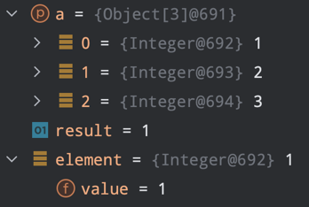
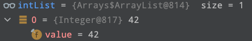

## 아이템 11. equals를 재정의하려거든 hashCode도 재정의하라

### 1) 포스팅 정리
[아이템 11. equals를 재정의하려거든 hashCode도 재정의하라](https://devfunny.tistory.com/924)

### 2) Volatile 변수
[[JAVA] Volatile 변수](https://devfunny.tistory.com/841)

### 3) Objects 클래스의 hash 메서드
``` Arrays의 hashCode() 메서드
public static int hashCode(Object a[]) {
    if (a == null)
        return 0;

    int result = 1;

    for (Object element : a)
        result = 31 * result + (element == null ? 0 : element.hashCode());

    return result;
}
```
- 속도가 느린 이유?
  - (1) 입력 인수를 담기위한 배열을 만든다.
  - (2) 기본 타입은 박싱/언박싱을 거쳐야한다.

위 2가지를 이해하기 위한 예제코드를 만들어보자.
```java
public class Test {
    public static void main(String[] args) {
        int a = 1;
        int b = 2;
        int c = 3;
        Objects.hash(a, b, c);
    }
}
```



```
result = 31 * result + (element == null ? 0 : element.hashCode());
```
위 코드에서 아래 Integer.java의 hashCode()를 호출한다.


> 지역변수 = 31 * 지역변수 + 핵심필드의 해시코드
- 곱할 숫자가 31인 이유는? 
  - 31이 홀수이면서 소수(prime)이기 때문이다.
  - 만약, 짝수이고 오버플로우가 발생한다면 정보를 잃게된다. (2를 곱하는건 시프트 연산과 같기 때문이다.)
  - 그리고 명확하지는 않지만, 소수를 곱하는 이유는 전통적으로 그래왔다고 한다.

## 아이템 12. toString을 항상 재정의하라

### 1) 포스팅 정리
[아이템 12. toString을 항상 재정의하라](https://devfunny.tistory.com/925)
