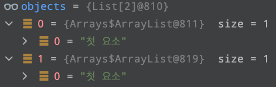
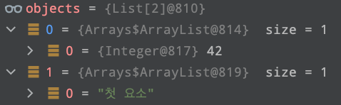

## 아이템 2. 생성자에 매개변수가 많다면 빌더를 고려하라

### 1) 포스팅 정리
[아이템 2. 생성자에 매개변수가 많다면 빌더를 고려하라](https://devfunny.tistory.com/527)

### 2) 자바 CheckedException vs UnCheckedException
> 강의에서 위 차이를 공부할때 트랜잭션 롤백 가능, 불가능은 맞지 않은 얘기라고 했다. 그 이유를 찾아보자.


위 표 내용은 잘못됬다. 트랜잭션에 UnCheckedException 예외에서는 롤백이 되고, CheckedException에서는 롤백이 안된다라는 규칙은 존재하지 않는다.
트랜잭션은 DB 트랜잭션 등 다양한 트랜잭션 종류가 있으므로 위 내용으로 트랜잭션을 일반화할 수 없다.
그리고 트랜잭션에 UnCheckedException 예외에서는 롤백이 되고, CheckedException에서는 롤백이 안된다라는 규칙은 우리가 정하는 것이다.
이런 글의 기원은 `스프링 트랜잭션 처리`에서 나온 내용이다.
스프링 트랜잭션 처리에서 UnCheckedException 계열은 바로 롤백을 하고, CheckedException는 롤백을 하지 않고, 그 반대로도 직접 설정할 수 있다.
모든 트랜잭션이 스프링 트랜잭션을 기본으로 하지 않기 때문에 위 내용은 맞지 않다는 뜻이다.


### 3) 가변인수
- 가변인수를 받는 메서드를 호출할 때마다 배열을 새로 할당하고 초기화한다.
- 제네릭 타입을 쓸때 신중히 사용해야한다. (추후 Item32 에서 공부한다.)
    - Heap Pollution 발생

### 4) Heap Pollution

#### 배열의 공변성
```java
class Animal {
  public void makeSound() {
    System.out.println("The animal makes a sound");
  }
}

class Dog extends Animal {
  @Override
  public void makeSound() {
    System.out.println("Woof!");
  }
}

public class Main {
  public static void main(String[] args) {
    Dog[] dogs = {new Dog(), new Dog()};
    Animal[] animals = dogs; // 배열의 공변성 적용
    animals[0].makeSound(); // 출력: Woof!
  }
}
```

Dog 클래스는 Animal 클래스를 상속받는다.
Dog 배열을 생성한 후, 이 배열을 Animal 배열에 대입한다.
Dog 배열은 Animal 배열의 하위 형식이므로, Dog 배열을 Animal 배열로 대체하여 사용할 수 있으며, 
animals[0]은 Dog 객체이므로 Dog 클래스에서 오버라이딩한 makeSound() 메소드가 호출된다. 
> 출력 결과 : Woof!


다시 돌아와서, Heap Pollution 예제를 살펴보자.
위 '가변인수' 내용에서 배열을 새로 할당하고 초기화한다고 했다. 
제네릭 타입 파라미터(List<T>)와 같은 실체화 불가 타입은 런타임 시 타입 정보가 소거된다.
이때 Heap Pollution이 발생할 수 있다.

```java
import java.util.Arrays;
import java.util.List;

public class VarargsHeapPollutionExample1 {
    public static void main(String[] args) {
        List<String> strings1 = Arrays.asList("첫 요소");
        List<String> strings2 = Arrays.asList("첫 요소");
        doSomthing(strings1, strings2);
    }

    private static void doSomthing(List<String> ... stringLists) { // 가변인자는 배열을 하나 만든다. -> List<String> 배열
        List<Integer> intList = Arrays.asList(42);

        // List<String> 가변인자를 Object[] 배열 변수로 초기화
        Object[] objects = stringLists;

        // 인덱스 0에 List<Integer> 타입의 변수 설정
        objects[0] = intList; // 힙 오염 발생

        String s = stringLists[0].get(0); // ClassCastException
    }
}
```
> [1] Integer 타입의 List 생성

```java
List<Integer> intList = Arrays.asList(42);
```


> [2] 가변인수로 받은 stringLists를 Object 타입 배열에 할당
- 가변인수는 List<String>[] stringLists 이므로 Object[]에 할당할 수 있다.

```java
Object[] objects = stringLists;
```


> [3] object의 0번째 원소에 intList 삽입
- 제네릭은 런타임 시 타입정보가 소거된다. 그렇기 때문에, 타입이 다른 List<Integer> intList의 할당이 가능하다.

```java
objects[0] = intList; // 힙 오염 발생
```


