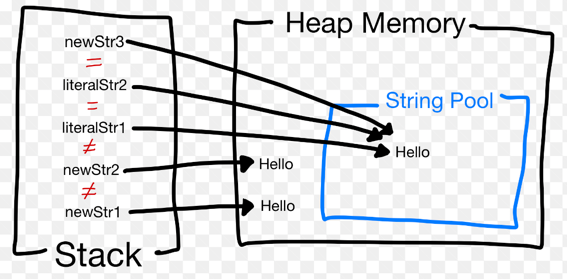

## 아이템 6. 불필요한 객체 생성을 피하라

### 1) 포스팅 정리
[아이템 6. 불필요한 객체 생성을 피하라](https://devfunny.tistory.com/531)

### 2) String literal vs new String
- 이미지로 보면 이해가 더 쉽다.
```java
public class Test {
    public static void main(String[] args) {
        String newStr1 = new String("Hello");
        String newStr2 = new String("Hello");
        String literalStr1 = "Hello";
        String literalStr2 = "Hello";
        String newStr3 = newStr1.intern();
    }
}
```


> String Pool
- Java Heap Memory 내에 문자열 리터럴을 저장한 공간
- HashMap으로 구현

> intern() 메서드
- String Pool에 같은 값이 있는지 찾는다.
- 같은 값이 있으면 그 참조값이 반환된다.
- 같은 값이 없으면 String Pool에 문자열이 등록된 후 해당 참조값이 반환된다.
- 리터럴로 문자열을 생성하면(내부적으로 String.intern() 호출)

> String Pool vs Constant String Pool 차이
- String Pool : 런타임에서 JVM(Java Virtual Machine)에 의해 자동으로 생성되는 고유한 문자열 리터럴의 풀로, 메모리를 절약하는 데 사용한다.
- Constant String Pool : String Pool의 하위 집합으로, 컴파일 시간에 상수 문자열 리터럴을 저장한다. 컴파일러가 컴파일 시간에 이미 알고 있기 때문에, 상수 문자열 풀에 저장된다.
따라서, String Pool은 런타임에서 생성되는 모든 문자열을 저장하고, Constant String Pool은 컴파일러가 이미 알고 있는 상수 문자열만 저장한다.

```java
public class Test {
    public static void main(String[] args) {
        String str1 = "Hello";
        String str2 = "World";
        String str3 = str1 + str2;
    }
}
```

- `Constant String Pool`에 저장 : 여기에서 "Hello"와 "World"는 컴파일 타임에 이미 알려진 문자열 리터럴이기 때문
- `String Pool`에 저장 : str3은 런타임에 생성되는 새로운 문자열

### 3) Pattern 사용
- 업무 적용 코드 보기

### 4) Map 인터페이스의 KeySet 메서드
Map 인터페이스의 KeySet 메서드는 Map 객체 안의 키 전부를 담은 Set 뷰를 반환한다.
KeySet을 호출할 때마다 동일한 Set 인스턴스를 반환하기 때문에 반환한 객체 중 하나를 수정하면 다른 모든 객체가 따라서 바뀐다.
따라서 KeySet이 뷰 객체를 여러개 만들어도 상관은 없지만 그럴 필요가 없는것이다.

```java
import java.util.HashMap;
import java.util.Map;
import java.util.Set;

public class Test {
    public static void main(String[] args) {
        Map<String, Integer> map = new HashMap<>();
        map.put("one", 1);
        map.put("two", 2);
        map.put("three", 3);

        Set<String> keySet1 = map.keySet();
        Set<String> keySet2 = map.keySet();
        System.out.println("Original key set: " + keySet1); // Original key set: [one, two, three]

        map.put("four", 4); // 요소 추가
        keySet1.remove("two"); // 요소 수정 (제거)

        System.out.println("Updated key set keySet1: " + keySet1);
        System.out.println("key set keySet2: " + keySet2); // keySet1 의 수정내역이 keySet2에도 적용된다.
        System.out.println("Original map: " + map); // remove된 "two"가 map 안에서도 제거되었다.
    }
}
```