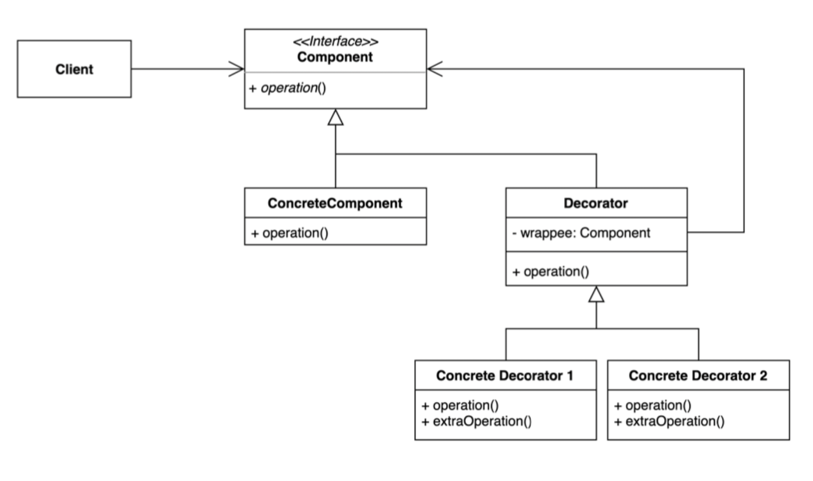
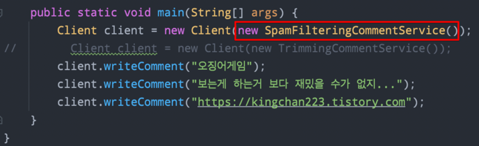
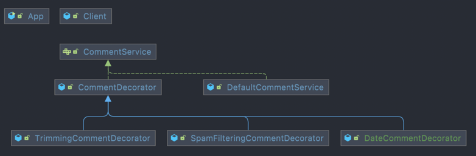

## 아이템 18. 상속보다는 컴포지션을 사용하라.

### 1) 포스팅 정리
https://devfunny.tistory.com/544

### 2) 데코레이터 패턴
https://github.com/seohaebada/2021to2022/tree/master/java/java_GoFdesignpattern/src/main/java/com/westssun/designpatterns/_02_structural_patterns/_09_decorator

> 위 github 예제에서 보면, 의존관계를 계속해서 바꿔줘야하는 불편함이 있다.
> 만약 클래스 2개를 모두 적용하고싶다면, 새로운 CommentService를 만들어야한다.

- 데코레이터 패턴 적용

- 이런식으로 객체의 결합을 통해 다양한 데코레이터들이 적용된다.
