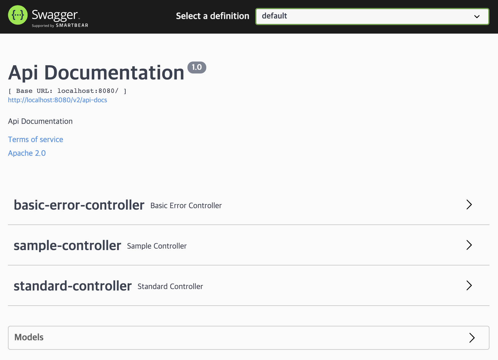
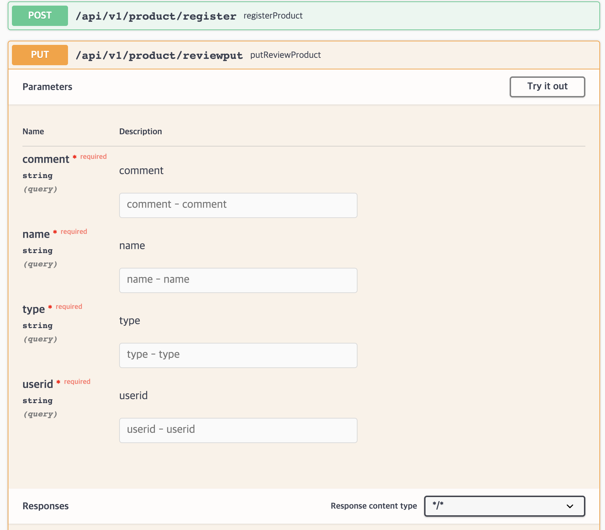
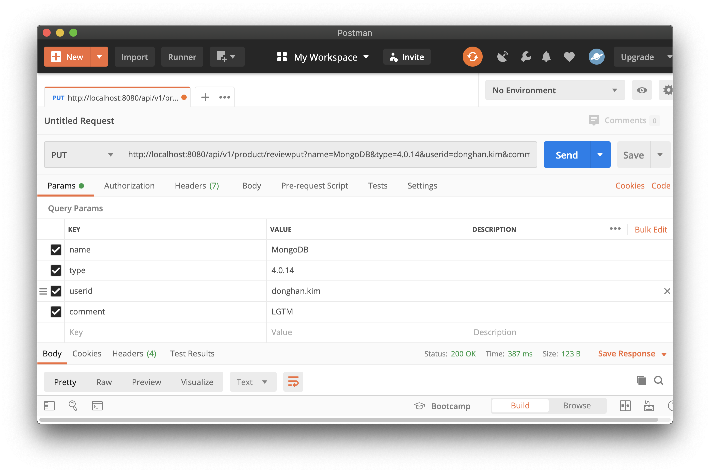

# MongoDB Spring Boot REST-API Sample

## Introduction

Maven 과 Spring Boot 를 기본으로한 MongoDB Java Sample 은 다음과 같은 의존성 패키지와 구조를 가지고 있습니다.

### Dependencies
Package Name|Version|Repository
-----|-----|-----
spring-boot|2.5.4|maven repos.
spring-boot-starter-data-mongodb|2.5.4|maven repos.
spring-boot-starter-data-rest|2.5.4|maven repos.
mongodb|4.2.3|maven repos.
springfox-swagger2|3.0.0-SNAPSHOT|jcenter-snapshots
springfox-swagger-ui|3.0.0-SNAPSHOT|jcenter-snapshots
springfox-data-rest|3.0.0-SNAPSHOT|jcenter-snapshots
Lombok|1.18.2|maven repos.

### Directory and Files Structure

```console
├── pom.xml
└── src
    ├── main
    │  ├── java
    │  │  └── com
    │  │      └── test
    │  │          └── training
    │  │              ├── TrainingApplication.java
    │  │              ├── SwaggerConfig.java
    │  │              ├── configuration
    │  │              │  └── MongoConfiguration.java
    │  │              ├── sample
    │  │              │  ├── SampleController.java
    │  │              │  ├── SampleDao.java
    │  │              │  ├── SampleEntity.java
    │  │              │  └── SampleService.java
    │  │              └── std
    │  │                  ├── StandardController.java
    │  │                  ├── dto
    │  │                  │  ├── Product.java
    │  │                  │  ├── Release.java
    │  │                  │  └── Review.java
    │  │                  └── repos
    │  │                      └── ProductRepository.java
    │  └── resources
    │      └── application.yml
    └── test
        └── java
            └── com
                └── test
                    └── training
```

## Getting Started

### Prerequisites

- Java 1.8 이상
- Maven 3.x / Maven Repository Access
- Spring 을 지원하는 Java IDE (Lombok 은 Plugin 필요)
- MongoShell 또는 mongosh, Compass 와 같은 MongoDB Client

#### Mongo Shell

[MongoDB Package](https://www.mongodb.com/try/download/community)

- Mac OS X

[mongodb-macos-x86_64-5.0.4.tgz](https://fastdl.mongodb.org/osx/mongodb-macos-x86_64-5.0.4.tgz)

```console
tar -xzvf mongodb-macos-x86_64-5.0.4.tgz
sudo cp mongodb-macos-x86_64-4.2.7/bin /usr/local/bin
sudo chmod 755 /usr/local/bin/mongod
```

- Windows

[mongodb-windows-x86_64-5.0.4-signed.msi](https://fastdl.mongodb.org/windows/mongodb-windows-x86_64-5.0.4-signed.msi)
[mongodb-windows-x86_64-5.0.4.zip](https://fastdl.mongodb.org/windows/mongodb-windows-x86_64-5.0.4.zip)

- Linux

패키지 버젼별로 MongoDB Download Site 를 이용 바랍니다.

#### mongosh (beta)

[MongoDB Shell](https://www.mongodb.com/try/download/shell)

- Mac OS X
[mongosh-1.1.6-darwin-arm64.zip](https://downloads.mongodb.com/compass/mongosh-1.1.6-darwin-arm64.zip)
[mongosh-1.1.6-darwin-x64.zip](https://downloads.mongodb.com/compass/mongosh-1.1.6-darwin-x64.zip)

- Windows
[mongosh-1.1.6-x64.msi](https://downloads.mongodb.com/compass/mongosh-1.1.6-x64.msi)

- Linux

패키지 버젼별로 MongoDB Download Site 를 이용 바랍니다.

#### Compass

[MongoDB Compass Download](https://www.mongodb.com/try/download/compass)

- Mac OS X
[mongodb-compass-1.29.5-darwin-x64.dmg](https://downloads.mongodb.com/compass/mongodb-compass-1.29.5-darwin-x64.dmg)

- Windows
[mongodb-compass-1.29.5-win32-x64.msi](https://downloads.mongodb.com/compass/mongodb-compass-1.29.5-win32-x64.msi)

- Linux
패키지 버젼별로 MongoDB Download Site 를 이용 바랍니다.

### Edit MongoDB Connection String

- src/resources/applcationapplication.yml

환경에 맞는 MongoDB Connection 관련 사항으로 ip address 나 host 명으로 수정 바랍니다.

#### Standalone or Shard Cluster (mongos)

```yaml
spring:
  data:
    mongodb:
      uri: mongodb://[user]:[user password]@localhost:27017/test?authSource=admin
```

#### ReplicaSet

```yaml
spring:
  data:
    mongodb:
      uri: mongodb://[user]:[user password]@localhost:27017,localhost:27018,localhost:27019/test?authSource=admin&replicaSet=replset
```

### Execution

```console
mvn comile
mvn spring-boot:run
```

### Swagger UI

- Open SWAGGER UI for API TEST

[http://localhost:8080/swagger-ui.html](http://localhost:8080/swagger-ui.html)

## Application Structure

### API LIST
RequestMethod|URL|Parameters
-----|-----|-----
POST|/api/v1/{db}/{collection}/insertone|db:database name<br>collection:collection name<br>parameter:Dynamic Parameter<br>body:RAW JSON


## Testing

- Swagger 나 Postman 같은 REST-API 테스트 툴을 이용하여 테스트가 가능 합니다.

### Spring Doc




### Post Man


