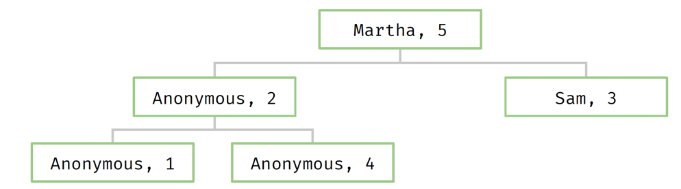
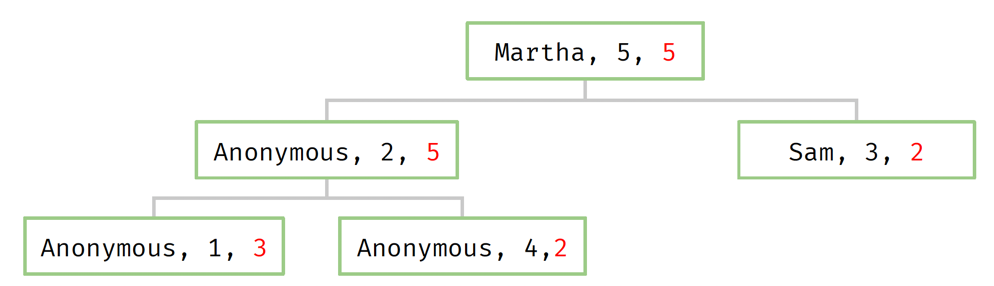
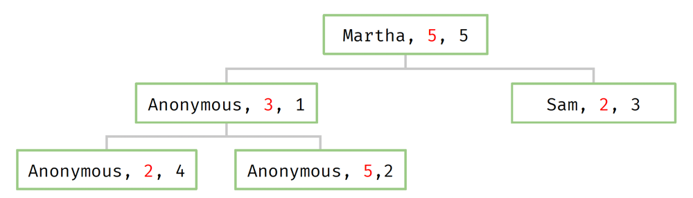

#### create index
```db.listingsAndReviews.createIndex({number_of_reviews:1})```
number_of_reviews_1

#### select index
```db.listingsAndReviews.getIndexes()```

#### index size
```db.listingsAndReviews.stats().indexSizes```

#### collection 정보
```db.listingsAndReviews.stats()```

#### Index Options
- index unique constraint
- NULL is a value (두번째 NULL부터 중복 제약에 걸림)
```db.a.createIndex({custid: 1}, { unique: true})```

#### Partial Index
- 특정 조건을 만족(partialFilterExpression)시키는 document에 대해서만 index를 걸겠다
- archived: false : archived 데이터(오래된 데이터)가 아닌 최근에 사용된 데이터에 한정해서 걸겠다는 의미
```db.orders.createIndex( { customer: 1, store: 1 },{ partialFilterExpression: { archived: false } })```

#### Sparse Index
- 필드가 존재하는 경우에 index를 걸겠다 (몽고DB는 필드가 필수가 아님 - document마다)
```db.scores.createIndex( { score: 1 } , { sparse: true } )```

#### Multikey Indexes
- 싱글 필드인데, 이 필드가 array 타입일때
- array 안에는 primitives(string, double 등), documents, sub-arrays 등의 타입이 들어갈 수 있다.

- Multikey basics
```
> use test
> db.race_results.drop()
> db.race_results.createIndex( { "lap_times" : 1 } )
> db.race_results.insertMany([
{ "lap_times" : [ 3, 5, 2, 8 ] },
{ "lap_times" : [ 1, 6, 4, 2 ] },
{ "lap_times" : [ 6, 3, 3, 8 ] }
])
> db.race_results.getIndexes()

// Answer Questions before running these two!
> db.race_results.find( { lap_times : 1 } )
- INDEX를 타고, FETCH를 해서 데이터를 가져온다.
- { "lap_times" : [ 1, 6, 4, 2 ] } 를 가져온다. (이 데이터를 통으로 가져온다.)
- 그럼 인덱스는 array의 각 element들을 b-tree 형식으로 가지고있고, 각 element는 _id를 가지고있기 때문에 1로 검색했을때 _id를 리턴하면서 array 데이터를 리턴한다.

> db.race_results.find( { "lap_times.2" : 3 } )
- b-tree를 활용하지 못하고 각 element들의 원소들은 모두 뒤져야하기 때문에 FULL_SCAN (어디 위치에 3이 있는지 확인해야하므로)
```

- Array of Documents
```
> db.blog.drop()
> db.blog.insertMany([
{"comments": [{ "name" : "Bob", "rating" : 1 },
    { "name" : "Frank", "rating" : 5.3 },
    { "name" : "Susan", "rating" : 3 } ]},
{"comments": [{ name : "Megan", "rating" : 1 } ] },
{"comments": [{ "name" : "Luke", "rating" : 1.4 },
    { "name" : "Matt", "rating" : 5 },
    { "name" : "Sue", "rating" : 7 } ] }
])

> db.blog.createIndex( { "comments" : 1 } )
> db.blog.createIndex( { "comments.rating" : 1 } )

// Answer Questions before running the below queries
> db.blog.find( { "comments" : { "name" :"Bob", "rating": 1 }})
- INDEX SCAN(IXSCAN) -> FETCH(_id로 실제 document 가져오기)

> db.blog.find( { "comments" : { "rating" : 1 } } )
- 매핑되는게 실제적으로 없다. "name", "rating" 두개를 묶은게 B-Tree의 key값이기 때문에 매칭되지 않는다.
- INDEX SCAN(IXSCAN) -> FETCH(0건)

> db.blog.find( { "comments.rating" : 1 } )
- comments.rating 으로 인덱스를 걸었을때 rating 값 자체가 index의 key가 된다. -> primitive 타입의 index
- comments.rating_1 인덱스를 탐 : INDEX SCAN(IXSCAN) -> FETCH 
```

#### Arrays of Arrays
```
> db.player.drop()
> db.player.createIndex( { "last_moves" : 1 } )
> db.player.insertMany([
{ "last_moves" : [ [ 1, 2 ], [ 2, 3 ], [ 3, 4] ] },
{ "last_moves" : [ [ 3, 4 ], [ 4, 5 ] ] },
{ "last_moves" : [ [ 4, 5 ], [ 5, 6 ] ] },
{ "last_moves" : [ [ 3, 4 ] ] },
{ "last_moves" : [ [ 4, 5 ] ] } ])

// Answer Questions before running below queries
> db.player.find( { "last_moves" : [ 3, 4 ] } )
- [3, 4]가 들어가있는 element 들이 출력됨, 인덱스도 타게됨

> db.player.find( { "last_moves" : 3 } )
- 인덱스는 타지만, 매핑은 안됨 
- 이 쿼리를 쓴 이유는 sub-array 안에 3이 있는지를 체크하는게 목적이였을 것이다.
- 위 의도한대로 수행시키려면 어떻게 해야할까? -> 아래 nested Query 를 사야한다.

> db.player.find( { "last_moves.1" : [ 4, 5 ] } )
- 두번째 element 가 [4, 5]인걸 찾아라 
- 인덱스는 못타고, 모든 document를 일일이 비교해서 찾음 (FULL-SCAN)
```

#### Nested query
```
//No results
> db.player.find({ "last_moves" : 3 })

//We get results but no index used
> db.player.find({ "last_moves" :
  { $elemMatch :
      { $elemMatch : {$eq : 3} }
  }
})
```
- 권장하진 않는다. 인덱스를 타는데 한계가 있을수있다.
```
> db.player.find( { "last_moves" : [ 3, 4 ] } )
> db.player.find( { "last_moves.1" : [ 4, 5 ] } )
```
- 이런 방식을 선호한다.


#### Compound Index
```
> msgs = [
{ "timestamp": 1, "username": "anonymous", "rating": 3},
{ "timestamp": 2, "username": "anonymous", "rating": 5},
{ "timestamp": 3, "username": "sam", "rating": 2 },
{ "timestamp": 4, "username": "anonymous", "rating": 2},
{ "timestamp": 5, "username": "martha", "rating" : 5 }
]
> db.messages.drop()
> db.messages.insertMany(msgs)
> //Index on timestamp
> db.messages.createIndex({ timestamp : 1 })
```
- 조회 쿼리를 날린다.
```
> db.messages.find(
    { timestamp : { $gte : 2, $lte : 4 } }
).explain("executionStats")

...
    executionStats: {
    executionSuccess: true,
    nReturned: 3,
    executionTimeMillis: 0,
    totalKeysExamined: 3,
    totalDocsExamined: 3,
...
```

- Need to filter for anonymous
```
> db.messages.find(
    { timestamp: { $gte : 2, $lte : 4 }, username: "anonymous" }
).explain("executionStats")

...
nReturned: 2,
executionTimeMillis: 0,
totalKeysExamined: 3,
totalDocsExamined: 3,

> db.messages.dropIndex("timestamp_1")

-- username까지 인덱스를 추가해보자.
> db.messages.createIndex( { timestamp: 1, username: 1 })
> db.messages.find(
    { timestamp: { $gte : 2, $lte : 4 }, username: "anonymous" }
).explain("executionStats")

-- totalKeysExamined 가 증가했다.
...
nReturned: 2,
executionTimeMillis: 0,
totalKeysExamined: 4,
totalDocsExamined: 2,
```

- timestamp, username 으로 인덱스를 걸어놓은 상태에서 아래와같이 데이터가 보인다.
```
Query: {timestamp:{$gte:2, $lte:4}, username:"anonymous"}
Index: { timestamp: 1, username: 1 }
```

- 3,Sam 은 쓸데없이 읽혀졌다.

- username, timestamp 순서로 바꿔보자.
```
Query: {timestamp:{$gte:2, $lte:4}, username:"anonymous"}
Index: { username: 1, timestamp: 1 }
```

- 2건만 읽고 찾는다. equals이 range 보다 먼저오는게 더 효율적이다.

- sort
```
> db.messages.find(
    { timestamp: {$gte:2, $lte:4}, username:"anonymous"}
).sort({rating:1}).explain("executionStats")

...
executionStats: {
executionSuccess: true,
nReturned: 2,
executionTimeMillis: 0,
totalKeysExamined: 4,
totalDocsExamined: 2,
executionStages: {
stage: 'SORT',
...
```
- sort 전의 결괏값이 크다면 sort 부하가 커진다.
- equals, range, sort 순서
```
Query: {timestamp:{$gte:2, $lte:4}, username:"anonymous"} Sort: { rating: 1 }
With Index: { username: 1, timestamp: 1 , rating:1 }
```


- 앞에서 5, 2 순이므로 sorting 이 발생해야한다. (2, 5)로 정렬해야하기 때문에 추가 정렬 발생

- equals, sort, range 순서
```
Query: {timestamp:{$gte:2, $lte:4}, username:"anonymous"} Sort: { rating: 1 }
With Index: { username: 1, rating: 1, timestamp: 1 }
```

- 2, 5가 이미 정렬된 상태이므로 추가적인 sorting 발생하지 않음

- [결론]
- Equality before range
- Equality before sorting
- Sorting before range


#### MultiKey Compound Indexes
```
MongoDB > use test
switched to db test

-- a,b,c index
MongoDB > db.multikey.createIndex({ a:1, b:1, c:1})
a_1_b_1_c_1

-- array 포함 (MultiKey)
MongoDB > db.multikey.insertOne({a:"temps",b:[1,2,3],c:4})
{
acknowledged: true,
insertedId: ObjectId("6114e952c8e5b75daaa54d33")
}
MongoDB > db.multikey.insertOne({a:"temps",b:2,c:[8,9,10]})
{
acknowledged: true,
insertedId: ObjectId("6114e95ac8e5b75daaa54d34")
}

-- 동시에 2개가 array일땐 에러 발생 
MongoDB> db.multikey.insertOne({a:"temps",b:[2,3],c:[8,9,10]})
MongoServerError: cannot index parallel arrays [c] [b]
```

#### Index Covered Queries
