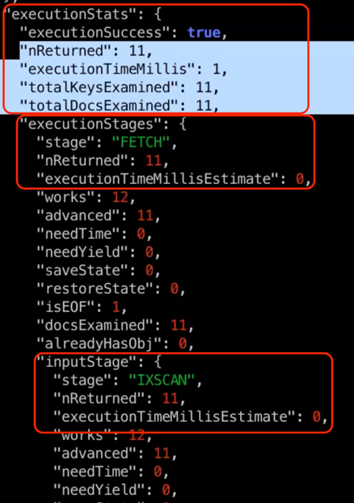

## 2일차 간단메모

### Index
- 자주 사용되는 서비스 패턴에 대한 index가 있어야함이 기본 원칙
- Speed up queries and updates
- Avoid disk I/O
- 몽고DB 에서의 동작방식
  - Data in an index is ordered. (B-tree)
  - 특정 필드에 대해 인덱스를 잡는다고 하면, 
    key-value 로 되어있으므로 key는 필드가 가르키는 값이고 value는 그 document를 가르키는 _id값이 될것이다.
  - _id로부터 실제 json document를 가져와서 결과를 준다.
- unique (_id)

### 몽고DB의 오해 
- MongoDB is so fast it doesn't need indexes
  - 인덱스의 존재는 중요하다.
- automatically indexed
  - 몽고DB는 인덱스를 걸어야 인덱스 수행된다.
- NoSQL uses hashes, not indexes
  - index를 통해서 접근을 하게되고, index의 종류 중에 hash index(샤딩 구성)가 있긴하다.

### Types of Indexes
- Single-field indexes : 컬럼 1 인덱스 
- Compound indexes : 컬럼 2개 이상에 인덱스 
- Multikey indexes : document (array 타입이 들어갈 수 있음) array 안의 각각의 element를 구성하는 type 인덱스 
- Geospatial indexes : geo hash 도출 후 -> b-tree 저장하는 방식
- Text indexes : 제약이 많음 (영어 위주)
- Hashed indexes
- Wildcard indexes : 특정 컬렉션 전체 또는 컬렉션의 필드의 특정 서브 document에 대한 인덱스


### Single-field indexes
- order는 중요치 않다. (역순이던 아니던 동일)

### 인덱스 생성 예시
```
> db.listingsAndReviews.createIndex({number_of_reviews:1})
number_of_reviews_1
```

### explain verbosity
1) "queryPlanner" : Shows the winning query plan but does not execute query
- default
- 각 plan cache에 plan shape(인덱스 타고, fetch하고 결과를 내려준 각 쿼리가 실행되는 stage 정보)를 뿌려준다. (쿼리 수행 전)
- winningPlan.stage : COLLSCAN(FULL SCAN과 동일)
3) "executionStats" : Executes query and gathers statistics
- 쿼리 수행을 직접 하고, 각 stage(index, fetch 별)별로 인덱스를 몇번 excess 했고 등 수행시간 등,, 수행정보를 뿌려준다.
- stage 별로 nReturned 등의 정보가 있음 
- "executionStats" 하위의 아래 4개 정보가 중요함 (아래 4개가 최소가 되야 좋음)
- nReturned : 총 몇건의 데이터 리턴?
- executionTimeMillis : 쿼리 수행 시간
- totalKeysExamined : index key를 몇번 excess 했는지 
- totalDocsExamined : 실제 풀스캔에서 excess document 건수
- 
  - 1. "IXSCAN" 인덱스 스캔 수행 후 11건을 다음단계로 넘김 (_id값)
  - 2. "FETCH" 에서 11건의 _id 값을 받고, 여기서 _id 기준으로 실제 document를 끄집어와서 (BSON) 얘를 리턴 (advanced:11 이므로 다음단계에도 11건 전달)
4) "allPlansExecution": Runs all candidate plans and gathers statistics.
- 여러개의 인덱스 중 옵티마이저는 cost가 가장 적은 best 를 골라야하는데, 이때 옵티마이저의 고민하는 과정을 뿌려준다.
- winning(실제 수행된 쿼리) 등
- queryPlanner, executionStats 다 있고, allPlansExecution 영역에 옵티마이저가 고려한 여러가지 단계들이 뜬다.

```
> use sample_airbnb
sample_airbnb
> db.listingsAndReviews.find({number_of_reviews:50}).explain() -- queryPlanner 방식으로 동작(default)
> db.listingsAndReviews.find({number_of_reviews:50}).explain("executionStats")
```

### Explainable Operations
- find()
- aggregate()
- count()
- update()
- remove()
- findAndModify()

### Listing Index
> db.listingsAndReviews.getIndexes()

### index Size
> db.listingsAndReviews.stats().indexSizes
- stats() : 해당 콜렉션의 관리되는 데이터들이 보인다. (ns: namespace (db명.collection명)) 

-- 34분

#### Hashed Indexes
- 균등 분배가 필요 -> hash Index 사용
- 원본 키가 너무 크면 hash Index 사용해서 index size를 줄일 수 있음

#### Indexs and Performance
- 인덱스가 많을수록 조회에는 좋다. (적정한 수는 유지해야한다)
- 오버헤드는 발생할 수 있다. (write 시점에 Index의 B-tree 가공도 함께 해줘야한다)
  - A에 인덱스 3개, B 인덱스 30개 있다고보자. insert 1건이 들어오면 A는 3개의 B-tree update, B는 30개의 B-tree update
  - index block들이 디스크에 있으면 A는 3개의 I/O, B는 30개의 I/O -> 디스크의 부하 발생
- 전체적으로 인덱스당 약 10%의 오버헤드가 있다
- 인덱스 갱신 시점 : inserted, deleted, updated (적정한 수의 인덱스 유지가 필요)

#### Index Limitations
- index size가 너무 크지지않게 유의깊게 관찰 필요
  - 인덱스가 커질수록 전체적인 캐시 성능이 떨어질 수 있음 

-- 48분