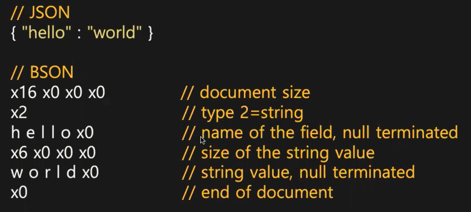
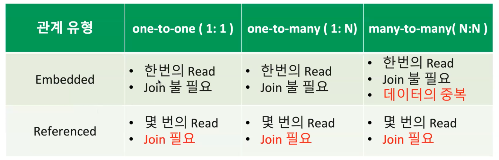

## 2일차 간단메모

### Index
- 자주 사용되는 서비스 패턴에 대한 index가 있어야함이 기본 원칙
- Speed up queries and updates
- Avoid disk I/O
- 몽고DB 에서의 동작방식
  - Data in an index is ordered. (B-tree)
  - 특정 필드에 대해 인덱스를 잡는다고 하면, 
    key-value 로 되어있으므로 key는 필드가 가르키는 값이고 value는 그 document를 가르키는 _id값이 될것이다.
  - _id로부터 실제 json document를 가져와서 결과를 준다.
- unique (_id)

### 몽고DB의 오해 
- MongoDB is so fast it doesn't need indexes
  - 인덱스의 존재는 중요하다.
- automatically indexed
  - 몽고DB는 인덱스를 걸어야 인덱스 수행된다.
- NoSQL uses hashes, not indexes
  - index를 통해서 접근을 하게되고, index의 종류 중에 hash index(샤딩 구성)가 있긴하다.

### Types of Indexes
- Single-field indexes : 컬럼 1 인덱스 
- Compound indexes : 컬럼 2개 이상에 인덱스 
- Multikey indexes : document (array 타입이 들어갈 수 있음) array 안의 각각의 element를 구성하는 type 인덱스 
- Geospatial indexes : geo hash 도출 후 -> b-tree 저장하는 방식
- Text indexes : 제약이 많음 (영어 위주)
- Hashed indexes
- Wildcard indexes : 특정 컬렉션 전체 또는 컬렉션의 필드의 특정 서브 document에 대한 인덱스


### Single-field indexes
- order는 중요치 않다. (역순이던 아니던 동일)

### 인덱스 생성 예시
```
> db.listingsAndReviews.createIndex({number_of_reviews:1})
number_of_reviews_1
```

### explain verbosity
1) "queryPlanner" : Shows the winning query plan but does not execute query
- default
- 각 plan cache에 plan shape(인덱스 타고, fetch하고 결과를 내려준 각 쿼리가 실행되는 stage 정보)를 뿌려준다. (쿼리 수행 전)
- winningPlan.stage : COLLSCAN(FULL SCAN과 동일)
3) "executionStats" : Executes query and gathers statistics
- 쿼리 수행을 직접 하고, 각 stage(index, fetch 별)별로 인덱스를 몇번 excess 했고 등 수행시간 등,, 수행정보를 뿌려준다.
- stage 별로 nReturned 등의 정보가 있음 
- "executionStats" 하위의 아래 4개 정보가 중요함 (아래 4개가 최소가 되야 좋음)
- nReturned : 총 몇건의 데이터 리턴?
- executionTimeMillis : 쿼리 수행 시간
- totalKeysExamined : index key를 몇번 excess 했는지 
- totalDocsExamined : 실제 풀스캔에서 excess document 건수
- 
  - 1. "IXSCAN" 인덱스 스캔 수행 후 11건을 다음단계로 넘김 (_id값)
  - 2. "FETCH" 에서 11건의 _id 값을 받고, 여기서 _id 기준으로 실제 document를 끄집어와서 (BSON) 얘를 리턴 (advanced:11 이므로 다음단계에도 11건 전달)
4) "allPlansExecution": Runs all candidate plans and gathers statistics.
- 여러개의 인덱스 중 옵티마이저는 cost가 가장 적은 best 를 골라야하는데, 이때 옵티마이저의 고민하는 과정을 뿌려준다.
- winning(실제 수행된 쿼리) 등
- queryPlanner, executionStats 다 있고, allPlansExecution 영역에 옵티마이저가 고려한 여러가지 단계들이 뜬다.

```
> use sample_airbnb
sample_airbnb
> db.listingsAndReviews.find({number_of_reviews:50}).explain() -- queryPlanner 방식으로 동작(default)
> db.listingsAndReviews.find({number_of_reviews:50}).explain("executionStats")
```

### Explainable Operations
- find()
- aggregate()
- count()
- update()
- remove()
- findAndModify()

### Listing Index
> db.listingsAndReviews.getIndexes()

### index Size
> db.listingsAndReviews.stats().indexSizes
- stats() : 해당 콜렉션의 관리되는 데이터들이 보인다. (ns: namespace (db명.collection명)) 

-- 34분

#### Hashed Indexes
- 균등 분배가 필요 -> hash Index 사용
- 원본 키가 너무 크면 hash Index 사용해서 index size를 줄일 수 있음

#### Indexs and Performance
- 인덱스가 많을수록 조회에는 좋다. (적정한 수는 유지해야한다)
- 오버헤드는 발생할 수 있다. (write 시점에 Index의 B-tree 가공도 함께 해줘야한다)
  - A에 인덱스 3개, B 인덱스 30개 있다고보자. insert 1건이 들어오면 A는 3개의 B-tree update, B는 30개의 B-tree update
  - index block들이 디스크에 있으면 A는 3개의 I/O, B는 30개의 I/O -> 디스크의 부하 발생
- 전체적으로 인덱스당 약 10%의 오버헤드가 있다
- 인덱스 갱신 시점 : inserted, deleted, updated (적정한 수의 인덱스 유지가 필요)

#### Index Limitations
- index size가 너무 크지지않게 유의깊게 관찰 필요
  - 인덱스가 커질수록 전체적인 캐시 성능이 떨어질 수 있음 

-- 48분

#### Index Prefix Compression
- 어떤 text 필드에 대해서 인덱스가 걸려있을때
```
fieldA (index 있어서 정렬되어있겠다)
------ 
each      each=>l (표현)
each1     each=>l1
eachaa    each=>laa
eachbb    each=>lbb -> 이런식으로 인코딩된 형태로 보이게되면서 size가 줄어든다.
eachcc
```
- Prefix Compression으로 최적의 size를 유지하고자한다.


-- 1시간 21분

#### Compound Indexes
- 2개 이상의 필드에 인덱스 (최대 32개까지 가능)
- order and direction 중요

```
createIndex({country:1,state:1,city:1})
find({country:"UK",city:"Glasgow"})
```

- 인덱스는 타지만 효율은 좋지않음
- 아래와 같이 튜닝 필요
```
createIndex({country:1,city:1,state:1})
```
- 따라서 중요한건 순서
  - Equality First
  - Then Range or Sort
    - Sort가 먼저 나옴으로써 Sort를 우회하는게 좋음 
      - Equals, Range 범위가 상당히 크면 Sort 오버헤드가 심할 수 있다. -> 인덱스를 활용해서 equals, sort를 먼저 하고 range 수행하는 전략을 취하자.


#### Index Covered Queries
- index scan, index 가리키는 _id 기준으로 document 실제 가져옴(fetch) 작업을 거치는데,
  이때 출력하고자하는 output이 index가 가지고있는 key에서 해결이 된다면 document까지 갈 필요가 없다.
  이때 document 접근을 줄일 수 있다.
- Don't forget to remove _id in the projection

```
MongoDB> use sample_airbnb //These numbers are obtained when the
shell and server are in same region.

MongoDB> function mkdata()
{ db.listingsAndReviews.aggregate([{$set:{x: {$range:[0, 10]}}},
{$unwind:"$x"},{$unset:"_id"},{$out:"big"}]).toArray()}

MongoDB> f
unction testidx() { start=ISODate() ; db.big.find({"address.countr
y":{$gte:"Canada"}},{name:1,_id:0}).batchSize(60000).
toArray() ; print(ISODate() - start + "ms")}

MongoDB> db.big.drop();mkdata();c=40;while(c--){testidx()}

// ~ 370-390 ms with no index, COLLSCAN of most of the DB
MongoDB>
db.big.drop();db.big.createIndex({"address.country":1}); mkdata();
c=40;while(c--){testidx()}

//~ 330-350 ms With an index on address.country
MongoDB> db.big.drop() ;db.big.createIndex({"address.country":1, name:1});
mkdata(); c=40;while(c--){testidx()}

//~ 290-320 ms with a covering index
MongoDB> db.big.drop() // IMPORTANT TO CLEAR UP THE SPACE
```

### Geospatial Indexing
- 기본적으로 인덱스는 순서가 있어야한다.
  - Locations - 동시에 2개가 같이 쓰인다면(West Or North와 같은) 어디가 앞이고 뒤인지 판별이 쉽지않다.
  - Geohashes (좌표 데이터로 내부적으로 변환하여 B-Tree에 넣어서 indexing)
  - Points / Lines / Circles / Polygons/ Groups of the above additive and subtractive

- Coordinate spaces
  - MongoDB can use Cartesian (2d) or Spherical Geometry (2dsphere)
  - 2dsphere 위주로 사용한다고 생각하자. (2d는 거의 사용할일이 없다)
```
> use sample_weatherdata
> db.data.createIndex({"position":"2dsphere"})
> joburg = {
"type" : "Point",
"coordinates" : [ -26.2, 28.0 ]
}
> projection = {position:1,"airTemperature.value":1,_id:0}
> //Distance in metres
> db.data.find({ position: { $geoNear: { $geometry: joburg,
$maxDistance: 100000}}}, projection)
{ "position" : { "type" : "Point", "coordinates" : [ -26.1, 28.5 ]
}, "airTemperature" : { "value" : 20.5 } }
{ "position" : { "type" : "Point", "coordinates" : [ -26.8, 27.9 ]
}, "airTemperature" : { "value" : 19 } }
{ "position" : { "type" : "Point", "coordinates" : [ -26.9, 27.6 ]
}, "airTemperature" : { "value" : 20 } }
{ "position" : { "type" : "Point", "coordinates" : [ -27,
27.5 ] }, "airTemperature" : { "value" : 20.3 } }
```

-- 1시간 57분

#### Time To Live (TTL) Indexes
```
> db.t.drop()
> db.t.insertOne({ create_date : new Date(),
user: "bobbyg",session_key: "a95364727282",
cart : [{ sku: "borksocks", quant: 2}]})
> db.t.find()
> //TTL set to auto delete where create_date > 1 minute old.
> db.t.createIndex({"create_date": 1},{expireAfterSeconds: 60 })
> for(x=0;x<10;x++) { print(db.t.count()) ; sleep(10000) }
```
- index를 생성했다가 지정한 시간만큼 유지되고, 시간이 지나면 자동으로 delete가 발생함 (documents 삭제)
- 데이터 양이 많을때 DB쪽 부하 -> 데이터 생성주기가 있으면 그에 따라 시간을 설정해서 지우도록하면 됨 
  - 만약 특정 패턴이 없다면 오버헤드는 생길 수 있음
  - 가장 많이 사용되는 index

####  Wildcard Indexes
- 모든 인덱스를 수동으로 잡은 후, 그럼에도 안되는 경우에! 사용한다.
- Compound Index의 대체는 아님 
- 싱글 필드 인덱스로 수행
  - 여러개의 조건이 들어가면 성능이 안좋아질 수 있다.
```
-- 모든 필드
db.coll.createIndex({"$**":1})

-- a 필드 있고, 그 밑에 b가 있고, 그 밑에 인덱스를 걸겠다  
db.coll.createIndex({"a.b.$**":1})
```

#### hint
- hint 대신? 
  - indexFilterSet 속성을 지정해줘서, 어떤 index를 타야할지 몽고DB 단에서 지정해줄 수는 있다.

#### Foreground Index (MongoDB Pre 4.2)
- lock을 잡고 collection 레벨의 lock을 잡고 빠른 빌드가 됨. DML은 막힘 (block), 서비스 단절 발생

#### Background Index (MongoDB Pre 4.2)
- 인덱스 빌드 시점과 빌드 끝나는 시점에 잠깐 lock 을 작게 잡음
- lock 을 잡았다 풀었다하는 과정을 계속 반복해서 index 빌드 성능 자체는 foreground 보다 안좋음

#### Hybrid Index (MongoDB 4.2+)
- 4.2 버전이후부터는 이거임
- 인덱스를 걸게되면 자동으로 lock을 안잡고, background 처럼 lock을 잡고 이것보다 성능을 더 개선함
- 서비스 중에 인덱스를 만들어도됨 

#### Rolling build
- primary Set, secondary set, secondary set 구조일 경우 
- Replica Set 에서 secondary를 하나 떼어내서 인덱스를 빌드 (아무도 접근하지 않음)
  - 기존에 primary Set, secondary set이 수행중
  - 인덱스 빌드 완료하면 다시 붙임 : replication을 통해서 그동안 받지못한 데이터들을 동기화 수행
  - 그리고 다른 secondary도 위 순서대로 빌드-동기화 수행
  - primary는 인덱스가 없으므로 step-down함, 나머지 secondary 중에서 primary로 승격함
  - 이 타이밍에 어플리케이션은 잠깐 끊어졌다 붙음 : 끊어졌다 붙는게 내부적으로 retry 수행해서 Exception이 발생하는건 아님
  - 이런식으로 무중단으로 인덱스를 빌드함 

#### Hidden Index
- index를 hidden으로 바꿔서 옵티마이저가 index가 없는것처럼함 (태우지 않음)
- 주로 index drop 전에 사용 

#### BSON
- MongoDB stores data as Binary JSON (BSON)
  - 사용자에게는 BSON -> JSON 전환해서 보여주는것 
- BSON provides support for all JSON data types and several others
- BSON was designed to be lightweight, traversable and efficient



#### _id field
- 모든 도큐먼트에서 unique한 값 
- _id를 통해서 데이터를 수정하거나 등 수행한다.
- array 일 수 없고 immutable 하다. (한번 등록 후 업데이트 불가능, 업데이트 하려면 delete-insert)
- default object id
  - 4 byte value + 5 byte random value + 3 byte counter 

```
var oid = ObjectId()
oid.getTimestamps() (앞의 4바이트로 날짜 출력 가능)
```
- MongoDB 3.4 부터 128-bit decimal 제공 

#### Null Handling
- null 을 값으로 봄 (null is a BSON type)

#### Sorting by Arrays
- 각각의 element를 key 로 B-tree에 들어간다. 이는 ordering 되었음을 뜻한다.
- 
```
> db.sortdemo.drop()
>
var docs = [ { x : [ 1, 11 ] }, { x : [ 2, 10 ] }, { x : [ 3 ] },{
x : [ 4 ] }, { x : [ 5 ] } ]
> db.sortdemo.insertMany(docs)
> db.sortdemo.createIndex( { x : 1 } )
x_1
// x : [ 1, 11 ] array comes first. It contains the lowest value.
> db.sortdemo.find().sort( { x : 1 } )
// x : [ 1, 11 ] array still comes first. Contains the highest value.
> db.sortdemo.find().sort( { x : -1 } )
```

#### Locking
- 동일한 레코드를 바라보고 DML을 날리면 웨이팅 발생 
- document 레벨에서 locking 을 제공 (atomic - 원자성, 처리가 되던지, 처리가 안되던지를 유지)

#### Optimistic Locking
- Pessimistic 비관적 잠금 : 어떤 변경하고자하면 document를 다른 트랜잭션에서도 변경할 수 있다고 가정하고, 먼저 lock을 잡으려고 시도
- Optimistic 낙관적 잠금 : 다른 트랜잭션이 변경할 수 있다고 가정하지 않고 (낙관적) 작업 수행하고, 충돌이 발생하면 retry한다 
  - MongoDB는 낙관적 락을 채택함 
  - 그래서 몇번을 기다렸다 라는 수치가 나옴(retry 횟수) : 실제적인 구현 방식 

#### MongoDB Relationship
- 모델링 전에 미리 데이터 패턴을 보고 미리 access 패턴을 정해야한다.
- 패턴이 어느정도 고려가 됬으면, Referencing 한다. (FK로 연결관계)
  - Referencing, Embedding


