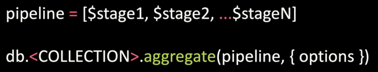
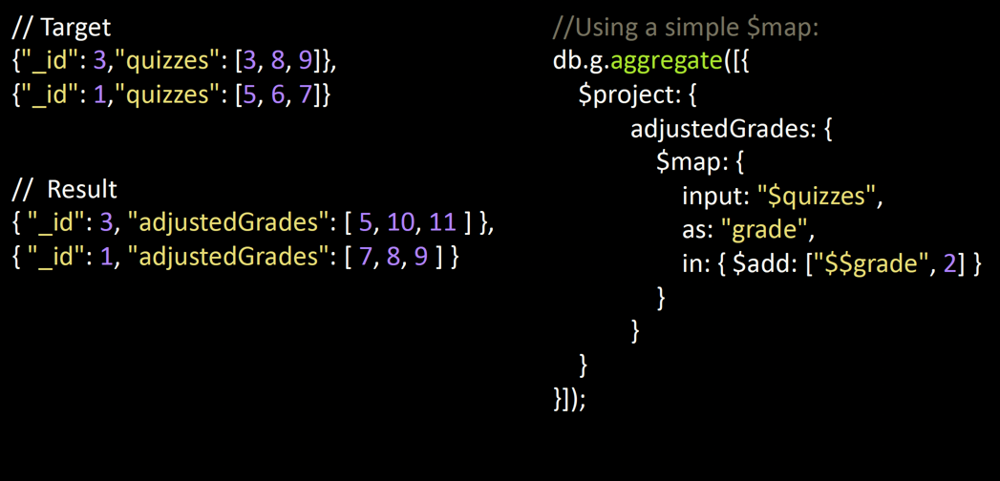
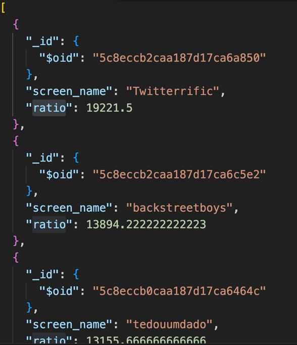
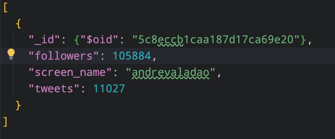

## Aggregation (집계) 
- MongoDB 의 Collection 의 데이터를 변환하거나 분석하기 위해 사용하는 집계 Framework
- SQL 에 익숙한 사람들을 위해 GORUP BY나 JOIN, AS 구문 및 Data Set을 계산할 수 있는 기능을 제공
- Aggregation Framework 는 Pipe Line 의 형태를 갖춤
- 각 Pipe Line 단계는 Stage 라는 최소 단위로 구성되어 있으며 $out 과 $geoNear 를 제외한 모든 Operator 가 1개 이상으로 중복 수행이 가능하다.

## Pipeline
- UNIX Pipe와 유사한 집적 파이프라인
- Pipe Line 의 각 단계
  - 입력으로 Collection 의 Document 를 받음
  - 해당 Document 에 대한 작업 수행
  - 다음 단계까지 사용할 Document Set를 작성한다.


## STAGE
### $match
- find() 와 유사하여 Aggregation 대상 Document를 조회
- find()에 들어가는 조건과 동일하다.

### $project
- documents 형태를 지정하거나 처리하고 싶은 Key 를 지정
- find()와 비슷한 기능인데, 더 많은 기능을 제공해준다.

### $sort
- Cursor 의 Sort 와 동일

### $group
- 여러개의 문서에서 필드 값을 집계하는데 사용

### $limit
- 각 Stage 에서 제한하고 싶은 Document 의 갯수 지정

### $lookup + $unwind
- SQL 의 Left-outer-Join 같이 다른 Collection 을 이용하기 위함


## EXPRESSIONS AND VARIABLES
- 집계의 단계에서 데이터를 참조하는데 사용하는 표현식과 변수

### Expressions
- 필드 경로를 사용하여 입력 Document 의 필드에 액세스
- 예, ```"$field"```

### Variables
- 사용자 정의 및 시스템 변수가 될 수 있음
- 모든 유형의 BSON 데이터를 저장할 수 있음
```"$$" + [a-z] + [_a-zA-Z0-9]```

### Example

- $$grade : 변수 

## $MATCH STAGE
- $match 연산자가 find()의 쿼리 단계처럼 작동
- 질의와 일치하는 파이프라인 내 Document는 후속 단계로 전달된다.
- $match는 종종 집적 단계에서 사용되는 첫 번째 연산자다.
- 다른 Aggregation Operation 처럼 단일 파이프라인에서 $match 가 여러 번 발생할 수 있다.

## PROJECT STAGE
- 다음단계에 필요한 문서들을 구체화할 수 있게 해준다.
- 가장 간단한 형태의 Shaping 은 $project 를 사용하여 관심이 있는 field 만 선택하는 것이다.
- $project 는 입력 Document 의 다른 필드에서 새 필드를 작성할 수 있다.
- $project 모든 입력 Document 에 대해 각 1개씩의 출력 문서를 만든다.

## Example
```
use('sample_training');

db.tweets.aggregate([
    // {
    //     $sample: {
    //         size: 2
    //     }
    // },
    {
        $match: {
          "user.friends_count" : { $gt : 0 },
          "user.followers_count" : { $gt : 0}
        }
    },
    {
        $project: {
            screen_name: "$user.screen_name",
            ratio: {
                // "user.friends_count" 로 나눈다.
                $divide: ["$user.followers_count", "$user.friends_count"]
            }
        }
    },
    {
        $sort: {
            // 역순 정렬 
            ratio: -1 
        }
    },
    {
        // 10개 제한
        $limit: 10
    }
])
```

- Result


## Example2
#### 실습
> Twitter 사용자당 하나의 문서가 있음
> 트윗을 100회 이상 한 'Brasilia' 시간대 이용자 중 팔로워가 가장 많은 사람은 누구인가.
> 각 트윗의 사용자 개체의 time_zone 필드에 표준 시간대가 있음
> 각 사용자의 트윗 수가 user.status_count 필드에 있음

```
use('sample_training');

db.tweets.aggregate([
    {
        $match: {
            "user.time_zone" : "Brasilia",
            "user.statuses_count" : { $gte : 100 } // 이상
        }
    },
    {
        $project: {
            "followers" : "$user.followers_count",
            "tweets" : "$user.statuses_count",
            "screen_name" : "$user.screen_name"
        }
    },
    {
        $sort: {
            // 역순 정렬
            followers: -1
        }
    },
    {
        $limit : 1
    }
])
```

- Result


