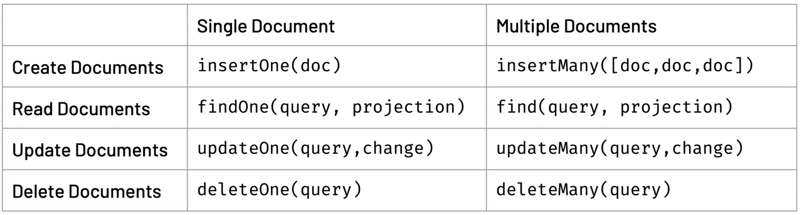

## 1일차 간단메모

### Document Model
- 몽고DB는 Document Model
  - json 형식?
    - 실제로는 json 아닌 BSON 형식이다. (압축이 쉽고, BSON의 경우 자바스크립트를 지원하는 JSON 보다는 조금더 많은 변수 타입을 지원한다. - BigDecimal, Binary format 등)
    - 

  - RDB에서 표현하기 애매한 데이터를 쉽게 표현 가능 
    - 
  - 필드가 있던없던 바로 데이터 삽입이 가능하다. (Agility)

### RDBMS <-> MongoDB
1) Database <-> Database
**2) Table <-> Collection**
(Database + Collection : Namespace)
**4) Row <-> Document
5) Column <-> Field**
6) Index vs Index

### Utility
single field, multi field, array field 등의 인덱스를 모두 지원함으로써,
복잡한 쿼리에 다양한 인덱스를 지원한다.

### 몽고DB를 어떤 경우에 사용해야할까?
- 복잡한 오브젝트를 빠르게 처리해야할때 (high-speed access to complex objects)
- Secondary indexes (여러가지 인덱스 제공)
- 집계 프레임워크 제공 (Aggregation capabilities)
- 분야 : Large Arrays, Text Fields, Binary Data

### When MongoDB should be used
- 빠른 개발 (rapid development)
- structures of varying shapes
- large data volumes (빠르게 커지는 데이터 저장)
- distributed data 
- Real-time distribution 

-- 47분

### CRUD Interactions

- 몽고DB는 collection이 없어도 insert 하면 새로 생성이 된다.
- _id를 지정해서 넣지 않으면 자동생성된다. 

### insertMany()
- ordered
  - false : 오류 발생시 그 다음 데이터 진행
  - true : 오류 발생시 그 이후 데이터는 진행하지 않음 

-- 1시간 21분