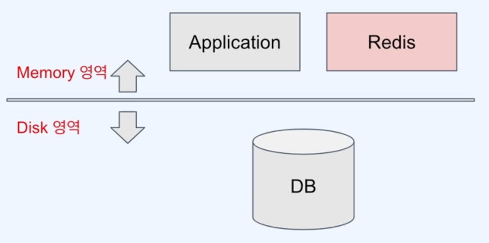
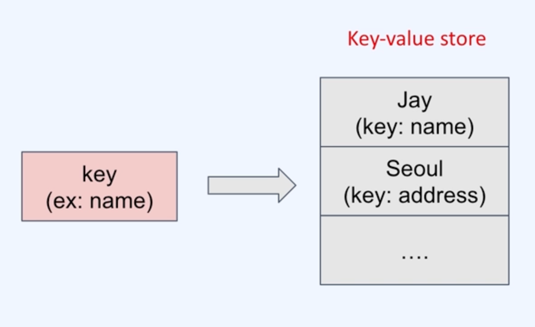

## 01. In-memory DB로서의 Redis

### 1) Redis의 Middleware 특성
최종적인 서비스 제공이 아닌, 애플리케이션이 본인의 서비스를 제공하기 위해 이용하는 중간 서비스
redis가 데이터를 저장/읽어오는 저장소지만, redis가 제공하는 기능들이 매우 다양하고 고급 기능들을 제공하기 때문에
이러한 특성들을 사용하기 위한 어떤 소프트웨어가 이용할 수 있는 기능을 제공해주는 미들웨어라고 생각할 수 있다.

### In-memory DB
- 데이터를 디스크에 저장하지 않고, 휘발성인 RAM에 저장 (속도가 빠름)

## 02. Key-value store로서의 Redis

### 1) key-value store?
- 특정 값을 key로 해서 그와 연관된 데이터를 value로 저장 (Map처럼)

- Hash 이용하여 속도가 빠름
- key를 통해서만 값을 읽을 수 있다는 단점이 있음 
- NoSQL DB(Redis, Riak, AWS DynamoDB)

## 03. Redis의 등장과 활용
별도로 구현해야했던 공통적인 기능들을 Redis를 사용하면 쉽게 구현 가능하다. 
- Session Store
- Cache
- Limit Rater 
  - ex) 특정 API의 분당 호출수 제한
- Job Queue 
  - ex) Producer-Consumer 역할과 같은 Queue 역할

