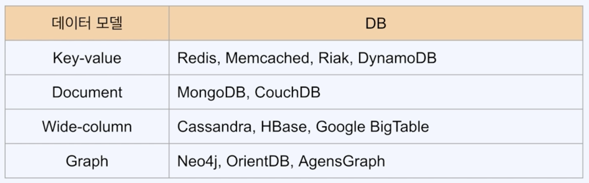

## 01. 관계형 DB의 이해

### 1) 관계형 DB
- 관계형 DB : 관계형 데이터 모델 사용
  - NoSQL : 다른 데이터 모델 사용
- SQL(Structured Query Language) : 관계형 DB를 관리하기 위해 설계된 질의 언어

## 02. NoSQL의 이해와 DB들 살펴보기

### 1) NoSQL
- Not Only SQL 또는 No SQL
- 관계형 DB에서 사용하는 SQL을 사용하지 않는다는 의미
- 비 관계형 데이터베이스 지칭

### 2) Nosql(비 관계형 DB)의 종류

## 03. NoSQL로서의 Redis

### 1) Redis는 DBMS인가?
- 데이터를 다루는 인터페이스를 제공한다는 DBMS 성격은 있음
- 기본적으로 영속성을 위한 DB는 아님
- 영속성을 지원(백업)
- DBMS보다는 빠른 캐시의 성격으로 대표됨
- DBMS에 더해서 사용하는 위주

### 2) 다양한 특성
- 기본적으로 NoSQL DB로 분류되는 key-value store
- 다양한 자료구조 지원(String, Hash, Set, List 등)
- External heap(외부 메모리)로서의 Redis
  - Application이 장애가 나도 Redis의 데이터는 보존(단기)
  - Application이 여러 머신에서 돌아도 같은 데이터를 접근 가능
- DBMS로서의 Redis
  - Redis의 영속화 수단을 이용해 DBMS처럼 이용
  - 일단 RDB 수준의 안정성을 얻기 위해선 속도를 희생해야함 (비효율적)
- Middleware로서의 Redis
  - Redis가 제공하는 자료구조를 활용해 복잡한 로직을 쉽게 구현 (Sorted Set)

### 3) NoSQL DB로서의 Redis
- Key-value store
- 다양한 자료구조 지원
- 원하는 수준의 영속성 구현
- In-memory 솔루션이라는 점에서 오는 특징을 활용할때 가장 효율적 
  - 빠른속도 활용하는 케이스

