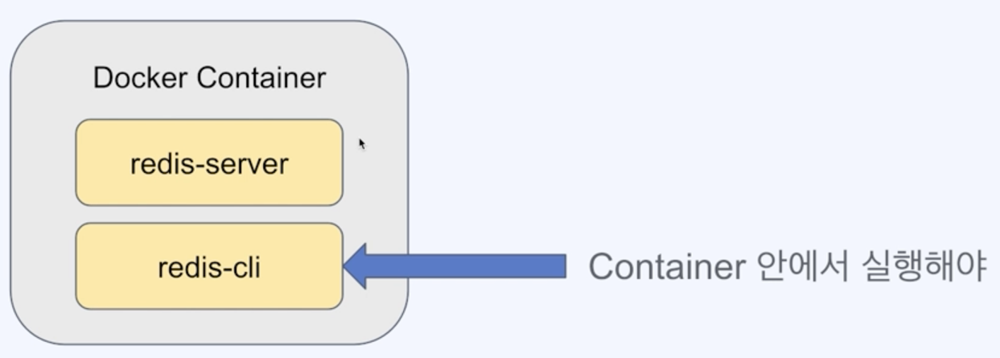

## 01. Redis 설치하기

### Docker + Redis 설치
> 참고 : https://devfunny.tistory.com/424

- docker registry에서 redis 이미지 불러오기
```
docker pull redis
```
- redis 실행
```
docker run --name my-redis -p 6379:6379 redis
```
- redis 중단
```
docker stop my-redis
```

## 02. Redis 커맨드 실습

### 1) Redis 모듈
- redis-server: 레디스 서버
- redis-cli: 레디스 서버에 커맨드를 실행할 수 있는 인터페이스


- Docker Container 안에서 쉘 실행
```
docker exec -it my-redis /bin/sh
```
- Container 내부의 쉘에서 Redis-cli 실행
```
redis-cli
```
- Redis 커맨드 사용 
```
set key1 banana
get key1

keys * 

dbsize

flushall
```