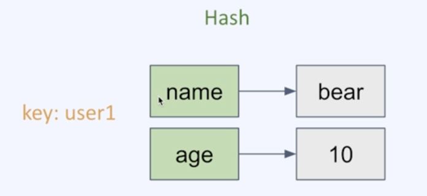
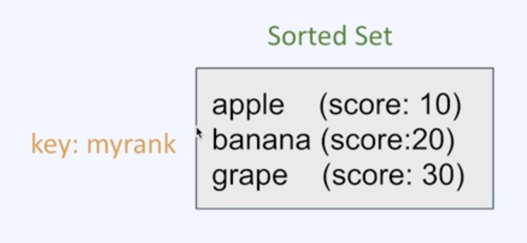
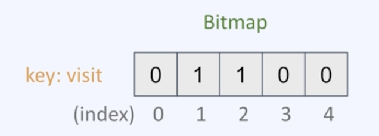

## 01. Strings

### 요약
- 바이트 배열을 저장 (binary-safe)
  - 모든 문자를 표현할 수 있음
- 바이너리로 변환할 수 있는 모든 데이터를 저장 가능(JPG와 같은 파일 등)
- 최대 크기 512MB

## 02. Lists

### 요약
- Linked-list 형태의 자료구조 (접근은 느리지만 데이터 추가/삭제가 빠름)
- Queue와 Stack으로 사용가능

## 03. Sets

### 요약
- 순서가 없는 unique한 값의 집합
- 검색이 빠름
- 개별 접근을 위한 인덱스가 존재하지 않고, 집합 연산이 가능(교집합/합집합 등)

## 04. Hashes

### 요약
- 하나의 key 하위에 여러개의 field-value 쌍을 저장
- 여러 필드를 가진 객체를 저장하는 것으로 생각할 수 있음

- HINCRBY 명령어로 카운터로 활용 가능 (방문수 등)
  - HINCRBY user1 viewcount 1 (user1 유저의 viewcount 필드를 1 증가시킨다)

## 05. SortedSets

### 요약
- Set과 유사하게 Unique한 값의 집합
- Set과 다르게 각 값은 연관된 score을 가지고 정렬되어있음
- 정렬된 상태라서 빠르게 최소/최댓값 구할 수 있음
- 순위 계산, 리더보드 구현 등에 활용


## 06. Bitmaps

### 요약
- 비트 벡터를 사용해 N개의 Set을 공간 효율적으로 저장(0, 1)
- 하나의 비트맵이 가지는 공간은 4,294,967,295(2의 32제곱 -1)
- 비트 연산 가능

- 특정일의 유저들의 방문현황을 저장한다고 했을때, 인덱스가 각 유저를 나타낸다했을때 42억명을 1개로 나타낼 수 있음

## 07. HyperLogLog

### 요약
- 유니크한 값의 개수를 효율적으로 얻을 수 있음
- 카운팅을 위한 용도
- 확률적 자료구조
  - 약간의 정확도를 포기함으로써 더 큰 효율성을 얻는다.
- 매우 큰 데이터 다룰 수 있음
- 0.81% 오차율 허용
- 12KB까지 메모리 사용
- 18,446,744,073,907,551,616(2의 64제곱)개의 유니크 값을 계산 가능
- 값을 넣을때 내부에 데이터를 저장하지 않음
  - HyperLogLog라는 내부적인 형식으로 가져감

```
PFADD today_visit Jay Peter Jane

PFCOUNT today_visit
> 3

PFADD yesterday_visit Jay Peter

PFCOUNT yesterday_visit
> 2

PFMERGE result yesterday_visit today_visit
> OK

PFCOUNT result
> 3
```
