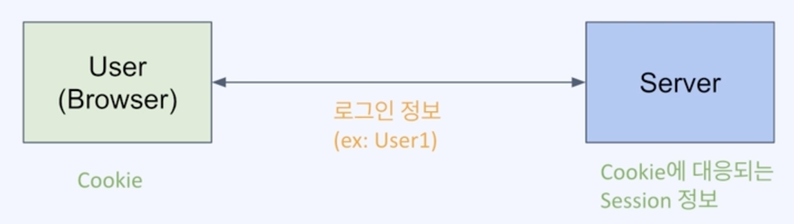
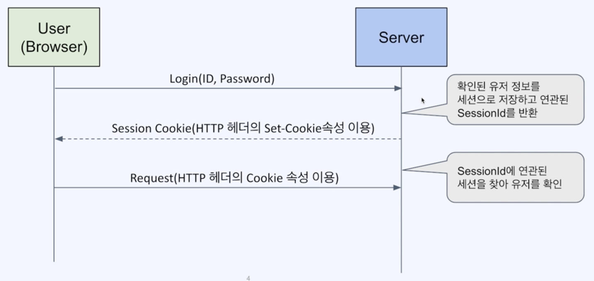
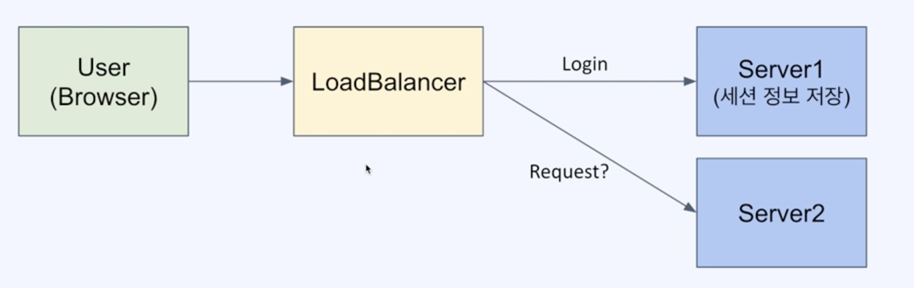
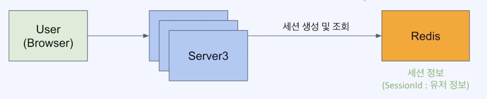
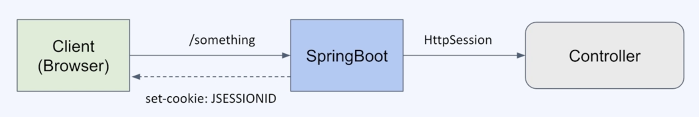

## 01. 세션이란

### 1) Session (세션)
- 네트워크 상에서 두개 이상의 통신장치 간에 유지되는 상호연결
- 연결된 일정 시간 동안 유지되는 정보를 나타냄

### 2) Web 로그인 세션
- Web 상에서 특정 유저가 로그인했음을 나타내는 정보
- 브라우저는 Cookie를, 서버는 해당 Cookie에 연관된 세션 정보를 저장한다.
- 유저가 로그아웃하거나 세션이 만료될때까지 유지되어 유저에 특정한 서비스 가능

### 3) Web 로그인 과정

### 4) 분산 환경에서의 세션 처리
- Server는 세션 정보를 저장해야하는데, Server가 여러대라면? Sever 간에 세션을 공유해야함
  - Session Clustering

- 세션 처리를 RDB를 사용한다면?
  - 관계형 데이터 모델이 필요한가?
  - 영속성이 필요한가?
  - 성능 요구사항을 충족하는가?
- 세션 처리를 Redis 사용
  - 세션 데이터는 단순 key-value 구조
  - 영속성 필요 없음
  - 변경이 빈번하고 빠른 액세스 속도가 필요

### 5) 세션 관리를 위한 서버의 역할
- 세션 생성 : 요청이 들어왔을때 세션이 없다면 만들어서 응답에 set-cookie로 넘겨줌
- 세션 이용 : 요청이 들어왔을때 세션이 있다면 해당 세션의 데이터를 가져옴
- 세션 삭제 : 타임아웃이나 명시적인 로그아웃 API를 통해 세션을 무효화함

> HttpSession
- 세션을 손쉽게 생성하고 관리할 수 있게 해주는 인터페이스
- UUID로 세션ID 생성
- JSESSIONID라는 이름의 cookie를 설정해서 내려줌

### 예제
> 02_SessionStore